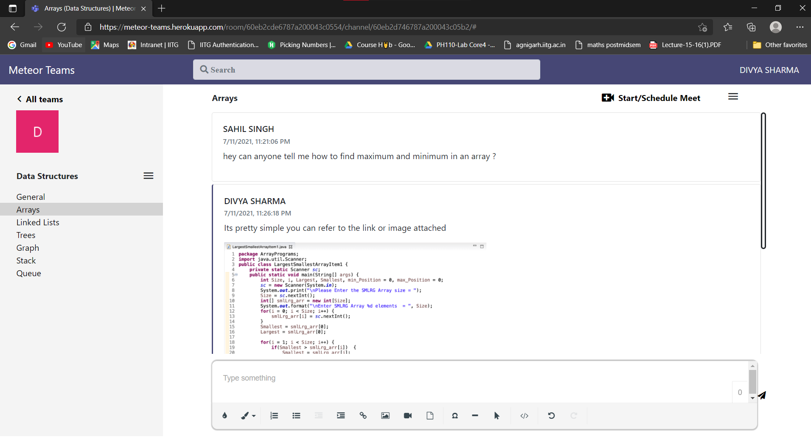
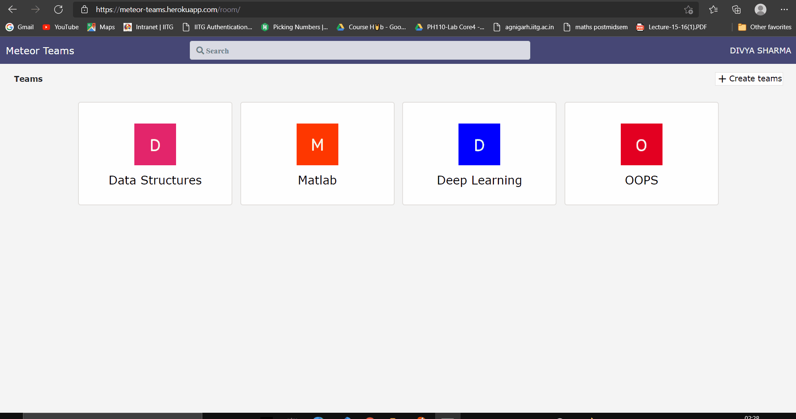
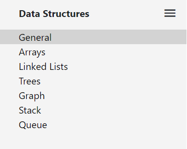
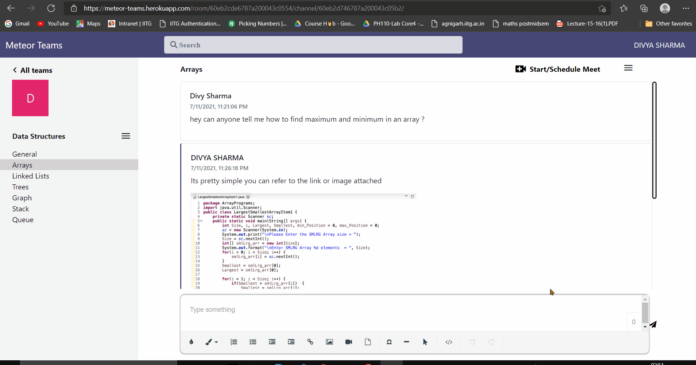
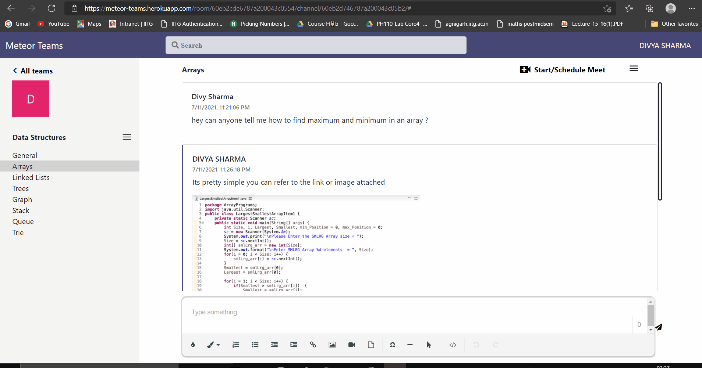
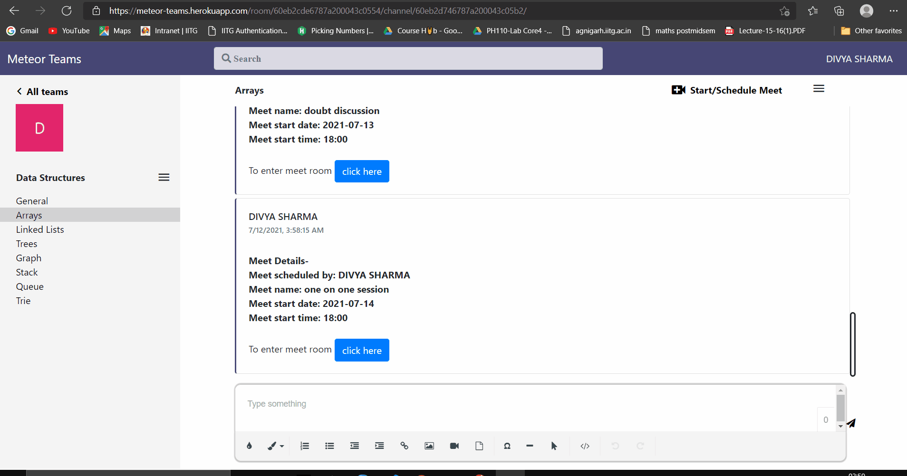

# Meteor Teams
### Meteor Teams is a chat based collaboration hub which helps in forming teams and working together using chat and channels .It is a workspace where you and your team can work together at the same time no matter where you are . Team members can easily collaborate with each other via text/video meets.
## Meteor Teams Features :
* ### Teams :

  Teams are groups of people brought together for work, projects, or common interests.  
  


&nbsp;
* ### Creating Teams :

  Create Teams by adding users using Meteor Teams by using their emails. Every new team will have a default channel called General ,which can be used for any purpose .Click on Users on Meteor Teams to get list of users using Meteor Teams with their emails. From team options users(present on Meteor Teams) can be added  to the team.
  

&nbsp;
* ### Channels :

  Channels are dedicated sections within a team to keep conversations organized by specific topics, projects, disciplines—-whatever works for your team!. Channels will only be seen if you are part of that channel.

  

  &nbsp;
* ### Creating Channels :

  Anyone present in a team can create channel by clicking on create channel option present in team options .User can click on Team members to know names and emails of all users that are part of the team . From channel options users (present in team) can be added  to the channel.

  

  &nbsp;
* ### Multi-Media Group Chat :

  Share your opinion and have fun with your team. Send files, videos, and pics in the channels.

  

  &nbsp;
* ### Start/Schedule Meetings :

  In a channel conversation,click start/schedule Meet to create new a meeting room.

  

  &nbsp;
* ### Meet Room :

  Meet Room is a place where discussion/ chat can take place before/during/after the meet. All channel meets can be seen by clicking on meets in channel options . User can go to meet room by clicking on the room in which he/she wants to go from meets or by clicking on click here in message with meet details.Channel meets are also present in meet room ,user can click on a meet to go to that meet room.

  

  &nbsp;
* ### Video Conferencing Room :

  Here video conferencing takes places , to join this conference user needs to click on join meet from meet room .All meet room conversations are visible here too .Messages sent during the conference is avaiable in meet room as well.Users can hide/show their video streams by clicking on camera icon or by pressing ctrl and v keys at the same time . Users can also mute/unmute themselves by clicking on mic icon  or by pressing ctrl and m keys at the same time. Users can also share their screens or stop screen sharing by clicking on screen share icon  or by pressing ctrl and x keys at the same time. Participants can also be seen by clicking on participants icon or pressing ctrl and z keys at the same time. To leave the conference users can click on end call icon and they will be redirected to meet room or by pressing ctrl and q  keys at the same time.

  

  &nbsp;

## Getting Started :
  These instructions will get you a copy of the project up and running on your local machine for development and testing purposes.

### Installing
  A step by step series of examples that tell you how to get a development env running

Cloning the repository:

```js
git clone https://github.com/divysharma007/MicrosoftTeamsClone.git
```
Installing the dependencies:
```js
npm install
```
Running the server:
```js
npm start
```
## Built with :
* ### MongoDB : Database
* ### Express : Server Framework
* ### Nodejs  : Server Environment
* ### Bootstrap  : CSS Framework
## Structure Used :
* ### Model,View,Controller
* ### Repository Pattern


## Author :
### Divya Sharma

                                                                                                        
                                                                                                        

      


